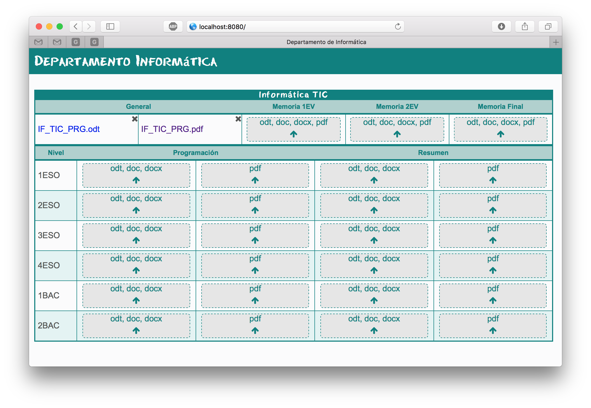

# Gestión de programaciones didácticas

Aplicación para facilitar la gestión de programaciones didácticas en IES.



## Pre-requisitos

* Apache/Nginx + PHP

* Librería ZipArchive:

```
sudo apt-get install php7.0-zip
```

## Instalación

* Bajar dependencias con composer, ejecutar desde la carpeta `gp`:

```
cd gp
composer update
```

* Crear virtualhost de Apache/Nging apuntando su raíz a `gp/public`.

* Cambiar propietario de `gp`:

```
chown -R www-data:www-data gp
```


## Configuración

Las tablas de departamentos, asignaturas y niveles por asignatura están en `gp/data/asignaturas.ods`.